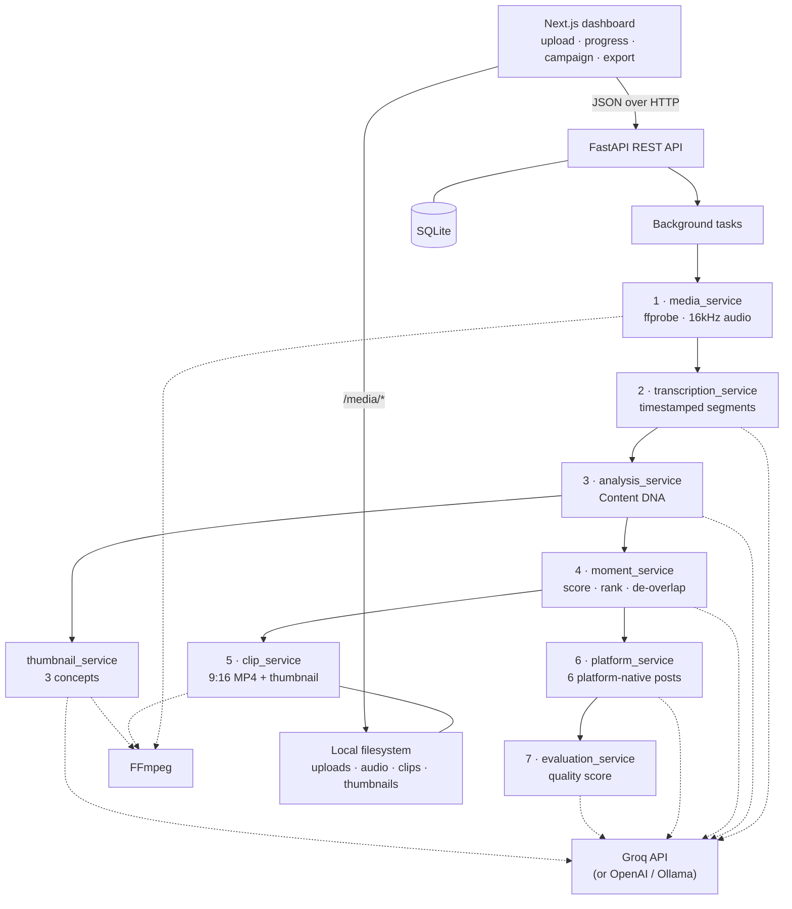

# RECAST

**One piece of content. An entire campaign.**

Upload one video. RECAST transcribes it, works out what it is actually about,
finds the moments worth clipping, renders real vertical shorts, and writes
native copy for six platforms — in about a minute.

<!-- Screenshot: finished project page with the "Campaign ready" banner -->

---

## Problem

A creator publishes one 20-minute video. To get value from it, they then do the
same job six times over:

- Watch the video back and hunt for clippable moments
- Cut each clip by hand, then re-crop it to 9:16 for Shorts, Reels and TikTok
- Write a YouTube title, description, chapters, SEO keywords and tags
- Rewrite the same idea as an Instagram caption, then again for TikTok, then
  Facebook, then LinkedIn, then X — each with different length, tone and CTA
- Pick a thumbnail and guess at a headline

It routinely costs **6–8 hours per video**, it is almost entirely mechanical,
and much of that effort underperforms — usually because the wrong moment got
clipped. Creators clip the introduction when viewers want the payoff.

Generic AI tools do not fix this. They will happily write *a* caption, but the
creator still has to watch the video, decide what matters, cut the clips,
re-explain the context in every prompt, and reconcile six inconsistent outputs.

## Solution

RECAST is an autonomous pipeline, not a chat box. One upload runs the whole
chain:

```
Video
  → Transcription          timestamped segments
  → Content DNA            topic, audience, tone, message, hooks, key moments
  → Best Moment Detection  candidate windows scored for clip potential
  → Short Generation       real 9:16 MP4s cut with FFmpeg
  → Platform Adaptation    six platform-native posts
  → Campaign               scored, exportable, ready to publish
```

**Content DNA is the single source of truth.** It is derived once, then every
downstream step consumes it. Nothing re-derives its own understanding of the
video, so the campaign stays internally consistent.

## Key Features

| Feature | What it does |
|---------|--------------|
| **AI Content DNA** | Structured understanding of the video — primary/secondary topics, audience, tone, content type, core message, key points, concepts, entities, keywords, hooks, CTA and timestamped key moments. Validated with Pydantic. |
| **Best Moment Detection** | Groups transcript segments into candidate windows, scores them on hook strength, information value, standalone quality and emotional interest, suppresses overlaps, and returns the top 3–5. |
| **Automatic Short Generation** | Cuts each moment into a real MP4 with FFmpeg, reframes landscape footage to 1080×1920 over a blurred backdrop, and extracts a thumbnail frame. |
| **Multi-platform Content Generation** | YouTube, Instagram, TikTok, Facebook, LinkedIn and X — each from its own prompt and its own model call. |
| **Platform-specific adaptation** | Every platform has its own spec for tone, length, structure, hook strategy and CTA strategy, validated against real limits (X 280 chars, YouTube title 100, per-platform hashtag caps). |
| **Campaign scoring** | An AI evaluator grades content quality, platform adaptation, hook strength, source consistency, SEO and CTA, and returns prioritised, concrete improvements. |
| **Thumbnail concepts** | Three distinct concepts with headline, visual concept, subject placement, emotional angle and recommended use case, previewed over real frames from the video. |

## Tech Stack

**Frontend** — Next.js 16 (App Router), TypeScript, Tailwind CSS v4, shadcn/ui

**Backend** — FastAPI, Python 3.12, SQLAlchemy

**AI** — Groq by default (`llama-3.3-70b-versatile` for reasoning,
`whisper-large-v3-turbo` for speech). The service layer is provider-agnostic:
OpenAI and fully-local backends (faster-whisper, Ollama) are implemented and
selected with one environment variable.

**Media** — FFmpeg / ffprobe

**Database** — SQLite

## Architecture



Content DNA (step 3) feeds every step after it — moments, clips, platform copy,
scoring and thumbnails all read the same understanding rather than deriving
their own.

The API key lives only in `backend/.env` and is read server-side. The browser
receives no credentials.

## How It Works

1. **Upload** — the video is streamed to disk (500MB cap, format validated) and
   a project row is created.
2. **Media processing** — `ffprobe` reads duration, resolution, fps and size;
   `ffmpeg` extracts 16kHz mono audio for transcription.
3. **Transcription** — audio becomes timestamped segments. Hosted uploads are
   FLAC-compressed first, roughly doubling the video length that fits under the
   provider's size cap.
4. **Content DNA** — the transcript is analysed into the structured object every
   later step depends on. Timestamps falling outside the video are discarded
   rather than trusted.
5. **Best moments** — Python builds candidate windows from consecutive segments
   (12–75s, always on real segment boundaries). The model selects and scores them
   **by window id, never by timestamp**, so a moment can never point at a time
   that does not exist. Overlapping picks are suppressed; the top 3–5 win.
6. **Shorts** — each moment is cut with FFmpeg. Already-vertical sources are
   stream-copied when the cut is accurate; landscape and square sources are
   reframed to 1080×1920 over a blurred backdrop so nothing is cropped away. A
   thumbnail is grabbed from the clip midpoint.
7. **Platform adaptation** — six separate model calls, one per platform, each
   with its own brief. Output is validated against that platform's real limits.
   YouTube chapters are built in Python from real timestamps and dropped unless
   they satisfy YouTube's rules (start at 0:00, at least 3, 10s apart).
8. **Scoring & export** — the campaign is graded across six dimensions with
   actionable recommendations, and the whole package can be copied or downloaded
   as a single file.

Every stage is resumable. A failure records the reason, preserves everything
already produced, and can be retried without re-uploading.

## Installation

**Requires:** Python 3.12, Node.js 20+, FFmpeg on PATH (`ffmpeg` and `ffprobe`),
and a free Groq API key from <https://console.groq.com/keys>.

### Backend

```bash
cd backend
py -3.12 -m venv .venv
source .venv/Scripts/activate        # Windows Git Bash
# macOS/Linux: source .venv/bin/activate
pip install -r requirements.txt
cp ../.env.example .env              # then paste your GROQ_API_KEY
uvicorn app.main:app --reload --port 8000
```

### Frontend

```bash
cd frontend
npm install
printf 'NEXT_PUBLIC_API_URL=http://localhost:8000\n' > .env.local
npm run dev
```

App: <http://localhost:3000> · API docs: <http://localhost:8000/docs>

### Optional — seed a finished demo project

Runs the real pipeline end to end (~45s) against a generated narrated sample:

```bash
cd backend && source .venv/Scripts/activate
python scripts/seed_demo.py
python scripts/seed_demo.py --video path/to/your.mp4   # or your own footage
```

### Tests

```bash
cd backend && source .venv/Scripts/activate && python -m pytest   # 227 tests
cd frontend && npm run build                                      # production build
```

## Environment Variables

Set in `backend/.env` — never committed, never sent to the browser.

| Variable | Required | Default | Purpose |
|----------|----------|---------|---------|
| `GROQ_API_KEY` | **Yes** | — | Transcription, Content DNA, moments, campaign, scoring |
| `TRANSCRIPTION_BACKEND` | No | `groq` | `groq` · `local` · `openai` · `auto` |
| `ANALYSIS_BACKEND` | No | `groq` | `groq` · `local` · `openai` · `auto` |
| `GROQ_ANALYSIS_MODEL` | No | `llama-3.3-70b-versatile` | Reasoning model |
| `GROQ_TRANSCRIPTION_MODEL` | No | `whisper-large-v3-turbo` | Speech model |
| `WHISPER_MODEL_SIZE` | No | `base` | Local Whisper size, if used |
| `OPENAI_API_KEY` | No | — | Only for the OpenAI backends |
| `OLLAMA_HOST` / `OLLAMA_MODEL` | No | `localhost:11434` / `llama3.2:3b` | Only for the local LLM backend |
| `IMAGE_GENERATION_BACKEND` | No | *(empty)* | No image API is wired up |
| `DATABASE_URL` | No | `sqlite:///./storage/recast.db` | SQLite location |
| `CORS_ORIGINS` | No | `http://localhost:3000` | Allowed frontend origins |
| `FFMPEG_BIN` / `FFPROBE_BIN` | No | `ffmpeg` / `ffprobe` | Override if not on PATH |

Frontend (`frontend/.env.local`): `NEXT_PUBLIC_API_URL`, defaulting to
`http://localhost:8000`. This is the only client-visible variable.

## Demo

A 2-minute run showing one video becoming a full campaign.

| # | Beat | What to show | ~Time |
|---|------|--------------|-------|
| 1 | **Upload** | Drag a video onto the dropzone; it opens the project. | 10s |
| 2 | **AI Understands** | The progress timeline advances. Point at Content DNA: topic, audience, tone, core message. | 25s |
| 3 | **Finds Best Moments** | Ranked moments with score breakdowns and "Why this works". | 20s |
| 4 | **Creates Shorts** | *Generate All Shorts* → real 9:16 clips play inline. | 20s |
| 5 | **Adapts to Platforms** | Press **Generate Campaign**, then click across the six tabs. Contrast the terse TikTok caption with the long-form LinkedIn post. | 30s |
| 6 | **Campaign Ready** | The banner — *"Everything is ready to publish"* — then **Download campaign** and open the file. | 15s |

Run `seed_demo.py` beforehand so a finished project is already on the dashboard;
demo that, and start a live upload only if time allows.

## Why RECAST?

A generic AI writing assistant is a **text tool**. RECAST is a **workflow**.

| | Generic AI assistant | RECAST |
|---|---|---|
| Input | Text you already prepared | The raw video file |
| Watching the video | You do it | Transcribed and analysed automatically |
| Choosing what to clip | You decide | Segments scored and ranked on clip potential |
| Cutting clips | A separate video editor | Real 9:16 MP4s produced by FFmpeg |
| Six platforms | Six prompts, six pastes, drifting context | Six briefs from one shared Content DNA |
| Consistency | Each answer re-invents the framing | Every output traces to the same source of truth |
| Output | Text in a chat window | Playable clips, thumbnails and an exportable campaign |

The important difference is **Content DNA**. The video is understood once, and
that understanding is reused everywhere. A chat assistant re-derives context on
every prompt, so its six captions drift apart. RECAST's six posts differ
*deliberately* — different tone, length, hook and CTA per platform — while
staying anchored to the same message.

It also does the parts a text model cannot do at all: reading the media,
timestamping it, scoring moments against real segment boundaries, and rendering
video.

## Limitations

Honest about what this build does and does not do.

- **No publishing.** RECAST prepares content; posting is still manual. No social
  APIs are integrated.
- **No authentication or multi-tenancy.** Any project is reachable by URL. This
  is a local build.
- **No image generation.** Thumbnails are render-ready specifications composed
  over real extracted frames, not AI-generated artwork.
- **No analytics or scheduling.** Nothing measures performance after publishing.
- **Single-language output.** Whisper detects and reports the spoken language,
  but generated copy is English.
- **Clip rendering is CPU-bound** — roughly 18s per short, sequential. Generate
  shorts before presenting.
- **Hosted transcription caps uploads at 25MB** (~25 minutes of video after FLAC
  compression). Longer videos need `TRANSCRIPTION_BACKEND=local`.
- **Groq's free tier caps at 100k tokens/day.** Heavy repeated demoing exhausts
  it; the app degrades gracefully rather than crashing.
- **Background tasks run in-process.** Restarting the API mid-run loses that run,
  though the project is preserved and can be retried.
- **Fewer than 3 moments** can be returned for short videos, where overlap
  suppression legitimately collapses near-duplicates.

## Future Work

- **Direct publishing APIs** — push straight to YouTube, Instagram, TikTok,
  LinkedIn and X instead of copy-paste.
- **Analytics feedback loops** — pull real performance back in so moment scoring
  learns which clips actually landed.
- **Creator-specific style learning** — adapt voice and hook patterns to an
  individual creator's back catalogue.
- **Historical content recycling** — mine an existing library for evergreen
  moments worth re-cutting.
- **Automated scheduling** — queue a campaign across a posting calendar with
  per-platform timing.
- **Multilingual support** — transcribe, analyse and generate in the creator's
  language, plus translated variants per market.

---

Deeper implementation notes — API contracts, validation rules and failure
behaviour — are in [`docs/TECHNICAL.md`](docs/TECHNICAL.md).
